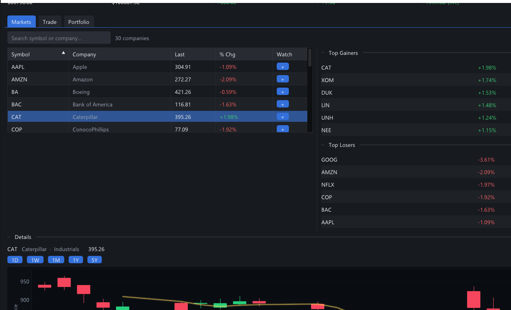
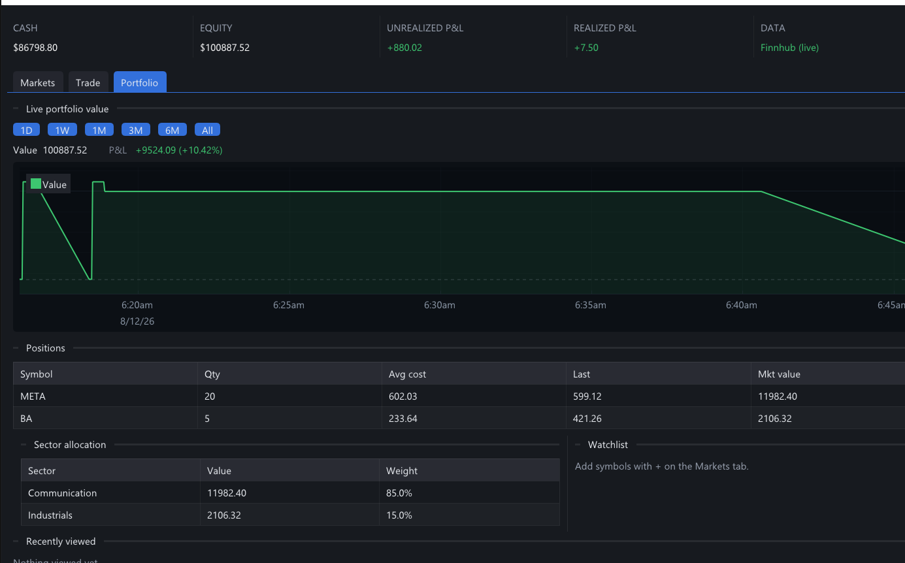

# PaperTrade

A native **Windows desktop paper-trading simulator** — browse a live market, place market & limit orders, and track a portfolio with real-time P&L. Built for **CS250 — Data Structures and Algorithms** at **NUST**, with every feature powered by data structures implemented from scratch in C++ (no STL containers in the graded core).




## Features

- **Live market data** for 30 companies (Finnhub with a key, or keyless Yahoo, or synthetic offline)
- **Market & limit orders** — limit orders auto-fill when the price hits your target
- **Portfolio & P&L** — positions, average cost, realized/unrealized, sector allocation
- **Professional charts** — candlesticks with zoom/pan, volume panel, MA20/50/200, crosshair OHLC tooltip, and a live equity curve (1D…All ranges)
- **Search, sortable market board, related stocks, recently viewed, watchlist**
- **Persistent** — cash, positions, orders and portfolio history are saved between sessions

## Run it without building

Download **`PaperTrade-App.zip`** from the [Releases](../../releases) page, extract it, and double-click **`papertrade.exe`**. No install, no dependencies — it uses free keyless live data.

## Build from source

**Requirements:** Windows, [MinGW-w64](https://www.mingw-w64.org/) (GCC), [CMake](https://cmake.org/) 3.16+

```bash
git clone https://github.com/furqanabdulrahman/PaperTrade.git
cd PaperTrade
cmake -S . -B build -G "MinGW Makefiles"
cmake --build build --target papertrade -j 4
./build/bin/papertrade.exe
```

The first configure downloads the dependencies (GLFW, Dear ImGui, ImPlot, nlohmann/json, cpp-httplib, Catch2) via CMake FetchContent.

**Run the tests:**

```bash
cmake --build build --target pt_tests -j 4
cd build && ctest
```

*(Optional: for live Finnhub data, create a `.env` file in the project root with `FINNHUB_API_KEY=your_key`. Without it, keyless Yahoo data is used.)*

## Data structures & algorithms

Every user-facing feature is driven by a hand-written structure:

| Feature | Structure / Algorithm |
|---|---|
| Sortable market board | 8-algorithm sorting engine (Strategy pattern) |
| Top gainers / losers | Min-heap / Max-heap |
| Related stocks | Weighted graph — BFS, Dijkstra, MST (Kruskal + union-find) |
| Recently viewed | Doubly linked list with cursor |
| Portfolio holdings & accounts | Separate-chaining hash table (custom FNV-1a) |
| Undo last trade | Stack (LIFO) |
| Order queue / price refresh | Queue / circular linked list |
| Sector allocation & browse | General n-ary tree |
| "Best move" insight | Dynamic programming (best time to buy/sell) |
| Ticker lookup | Binary search tree (+ self-balancing AVL) |

Backing store for everything is a hand-built `DynamicArray<T>` (rule-of-five). **69 Catch2 unit tests** cover the structures and business logic.

## Architecture

- **`pt_core`** — all graded data structures, domain logic, order engine, and services (UI-free, unit-tested)
- **Desktop GUI** — Dear ImGui + GLFW/OpenGL, ImPlot for charts
- **Data services** — WinHTTP (native TLS, no OpenSSL) → Finnhub / Yahoo, synthetic fallback

## Authors

- **Furqan Abdul Rahman** — CMS 522209
- **Hina Maryam** — CMS 502680
